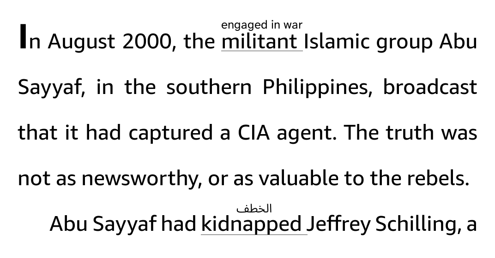

# WordWise CEFR

A fork of [omer-faruq's Inline Hints](https://github.com/omer-faruq/inlinehints.koplugin)
-- the Kindle Word Wise style plugin for KOReader -- with these additions:

- **Pick your English level (CEFR A1–C2)** instead of rarity steps: a word gets
  a hint when its learner level is above yours. Real CEFR-J (A1–B2) and
  Octanove (C1–C2) data, which the pack already carried.
- **Hint font and size settings** (10–18), with the line gap scaling to the
  size instead of a fixed doubled line height.
- **Two fallback dictionaries bundled and installed for you**: English–Arabic
  (FreeDict, GPL) and short English definitions (Open English WordNet,
  CC BY 4.0) — copied into `koreader/data/dict/` on first open.
- **Proper Arabic (RTL) hints** — glosses are shaped with the reader's own
  HarfBuzz/FriBidi engine instead of painted as isolated letters.
- **Max hints per page** (5–30) — when a page offers more worthy words than
  the limit, the rarest win the spots.
- **Known words** — type a word in and it is never hinted again, in any
  form; tap it in the list to forget it. **Or tap the hint itself**: a
  popup asks *"mark as known?"* — accept and the whole family goes
  (*kidnapped* takes *kidnap*, *kidnapper*, *kidnappers* along). You can
  also drag-select a word and use **Mark known** in the selection popup.

Coming from the original Inline Hints? Your settings migrate on first run, and
books you enabled there come back enabled (see Installing).



Hints are in whatever language your dictionaries are in — the two bundled
fallbacks speak Arabic and English, and the meanings come from StarDict
dictionaries, so nothing is fetched while you read. The bundled data only
decides *which* words are worth explaining.

## This fork: pick your CEFR level (A1–C2)

Upstream picks hints by word *rarity* — six frequency steps. This fork picks
them by *learner level*: you state your own English level (A1–C2), and a word
gets a hint when its CEFR level is above yours. Pick **B1** and the B2/C1/C2
words — plus anything no learner list knows — get explanations, while the words
a B1 reader already knows stay clean.

The CEFR tags are real learner-vocabulary data (CEFR-J A1–B2, Octanove C1–C2),
already stored in the language pack; upstream shipped them but only used them
to keep words in the pack. Words with no CEFR tag are hinted at any level,
which is the honest answer: if no learner list A1–C2 has a word, no reader at
those levels can be assumed to know it.

**Settings → Which words get a hint** is now the level picker, defaulting to
B1. Rarity is still used as the fallback for untagged words and for the
collision rule (the rarer word keeps its hint when two can't both be drawn).

## Hint text size

**Settings → Hint text size** — the gloss is drawn small so it fits in the
leading above its word; this setting makes it bigger or smaller (10–18,
default 12). The line spacing scales with it: the room a hint needs is the
room the line gives it, so bigger hints open more leading. Changing it
re-renders the book, the same as turning hints on does.

## Hint font

**Settings → Hint font** — every font KOReader can see (bundled ones plus
anything in your fonts folder), defaulting to the reader's UI font. If the
chosen face has no glyphs for a hint's language, the reader's fallback fonts
cover the missing script, so an Arabic hint stays readable with any pick.
Unlike the size, the font doesn't change the line spacing.

## Bundled fallback dictionaries

Two StarDict dictionaries ship **inside the plugin** (`dictionaries/`) and are
copied into `koreader/data/dict/` automatically on first open — existing
dictionaries are never touched, and it only happens once:

- **English-Arabic (FreeDict)** — 77k pairs, from FreeDict's `eng-ara` 0.6.3
  (GPL). Short translations, not full definitions.
- **English definitions (WordNet)** — 102k one-line senses, from the Open
  English WordNet 2025 release (CC BY 4.0), shortest definition per word.

After that they appear in the plugin's dictionary picker like any other
dictionary: tick the ones you want, put the ones you trust first. Rebuild
them with `tools/build_stardict.py` (docstring has the usage); the build
inputs are downloaded separately and never committed. wordwise.koplugin's
bundled dictionary was considered and rejected: that repository has no
license, so its data may not be redistributed.

## Installing

Copy this folder as `wordwise-cefr.koplugin` into KOReader's `plugins/`
folder. Coming from the original Inline Hints? Your settings come along:
the plugin migrates the old `inlinehints.lua` settings file on first run,
and books enabled under the old name come back enabled. Removing the old
plugin folder is recommended once you've switched (this fork and upstream
no longer share an id, so both can even be installed side by side).

Updating from 1.2.0? Delete `data/dict/FreeDict-English-Arabic` and
`data/dict/WordNet-English` once: those very first copies predate the
upgrade marker, and the plugin only replaces dictionaries it installed
itself.

## Using it

**Tools → WordWise CEFR → Show hints while reading.** It is remembered per book,
and turning it on reloads the book once (it changes the line spacing to make
room, which the engine has to re-render for).

Under its **Settings**:

- **Which words get a hint** — your own English level, A1 to C2 (see the fork
  section above). `abate` gets a hint at B1; `feature` never does.
- **How long a hint may be** — one to three meanings.
- **Dictionaries to take meanings from** — tried in the order KOReader lists
  them, and the first one with something short enough to fit wins. Turn off the
  ones that aren't a useful source: an English-English dictionary will happily
  answer with an English sentence and beat the bilingual dictionaries below it.

Tapping a word still opens the full dictionary entry, as always. A hint is a
reminder, not a replacement.

**Diagnostics** is for when a hint looks wrong. It prints each stage — the raw
entry, the text pulled out of it, the meaning chosen — to the log, which is the
only way to tell a dictionary's formatting from a real bug.

## What it does and doesn't do

It hints English words. The rarity data and the base-form table are
English-only, and the word walk assumes spaces between words, so other source
languages need their own language pack.

It has no way to tell which sense of a word is meant. Dictionaries list senses;
we take the first. This mostly stops mattering because common words don't get
hints at all — `feature` is left alone, so its wrong first sense never appears —
but a rare word with several meanings can still be hinted with the wrong one.

Names are filtered by capitalisation: a word that never appears in lower case
anywhere in the book is treated as a name. Without this, a character called Trig
gets hinted from the rare adjective "trig". The cost is a rare word that only
ever appears at the start of a sentence, which goes unhinted.

## Building the language pack

`inlinehints_en.sqlite3` ships with the plugin, so there is nothing to do unless
you want to rebuild it:

```sh
pip install wordfreq
python tools/build_en_db.py ecdict.csv inlinehints_en.sqlite3 cefrj.csv octanove.csv
```

Three sources, each doing the one thing it is good at — see the comments in
`tools/build_en_db.py` for why none of them can do the others' jobs.

## Tests

```sh
luajit tests/run_tests.lua
```

They need no KOReader and take about a second. Most of them hold real data
captured from real dictionaries and real pages, because that is where nearly
every bug in this plugin came from: the code looked right and the output was
wrong.

## Licence and credits

The plugin is AGPL-3.0 (see `LICENSE`), matching KOReader itself. The generated
language pack inherits the licences of its sources, which require attribution:

| Source | Licence | Used for |
| --- | --- | --- |
| [wordfreq](https://pypi.org/project/wordfreq/) | Apache-2.0 | How common a word is |
| [ECDICT](https://github.com/skywind3000/ECDICT) | MIT | Base forms (`murdered` → `murder`) |
| [CEFR-J Vocabulary Profile](https://github.com/openlanguageprofiles/olp-en-cefrj) | Free with citation | Learning stage, A1–B2 |
| [Octanove Vocabulary Profile C1/C2](https://github.com/openlanguageprofiles/olp-en-cefrj) | CC BY-SA 4.0 | Learning stage, C1–C2 |

Word Wise is Amazon's; this plugin is not connected to it and is only described
by comparison.
